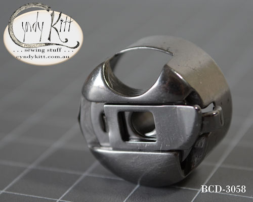
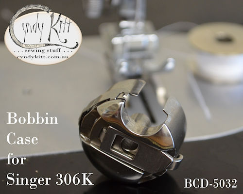
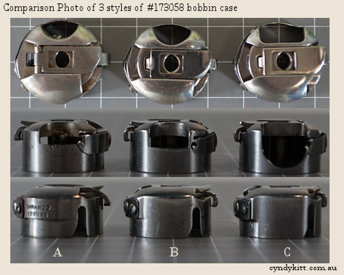
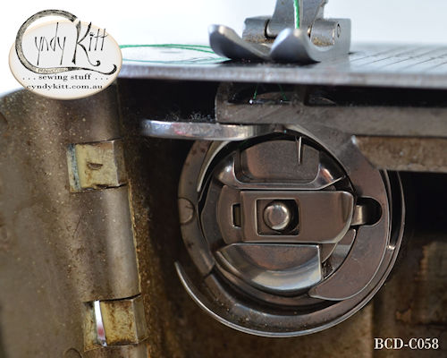
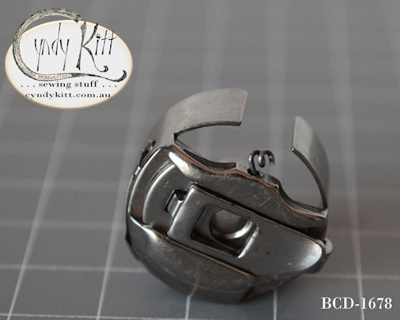

The Singer 206 family of machines inspire both love and hate with lovers of vintage machines.

&nbsp;

To the best of my investigations the original 206 was originally developed by the Singer factory in Wittenberge, Prussia (Germany) in the 1920s, as was the 201 class and the 15D88 (later to be 15-88 and 15K88).   There is very little known about the Wittenberge design team, but as the 206D, 201D and 15D88 were all in production five to ten years before they were manufactured in the US or Great Britain, reason suggests they are German designs.   Back to the 206 family of machines, although the original 206D and early 206K used regular point domestic needles, Singer developed 206&times;13 class needles which are essentially a 15&times;1 (also referred or as HA&times;1, 705 and 130 class) needles with a shorter point. To the best of my knowledge Schmetz are the only needle manufacturer still producing 206&times;13 needles and the range is limited to two sizes and with a few exceptions only available online.   There is fierce debate in the VSM world about using 15&times;1 needles, but after much experimentation I feel as long as you are aware of the potential danger of needle strike, take extra care not to cause needle any deflection, even with the original case you should be okay, but using one of the cases I supply will make it safer.

<!-- end col -->

&nbsp;

<!-- end row -->
<h2>New Parts</h2>

