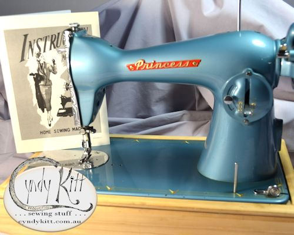
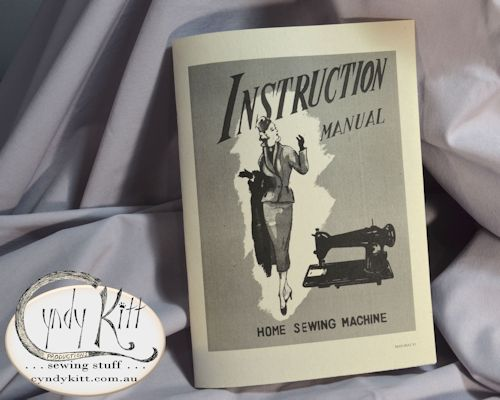
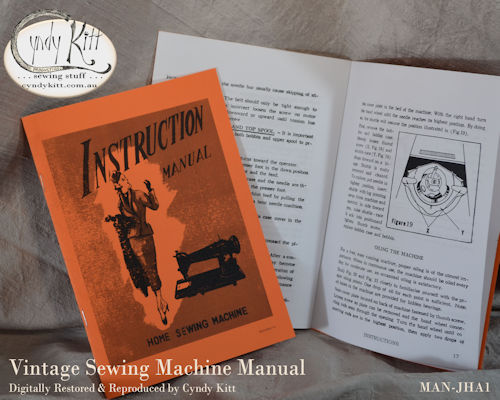
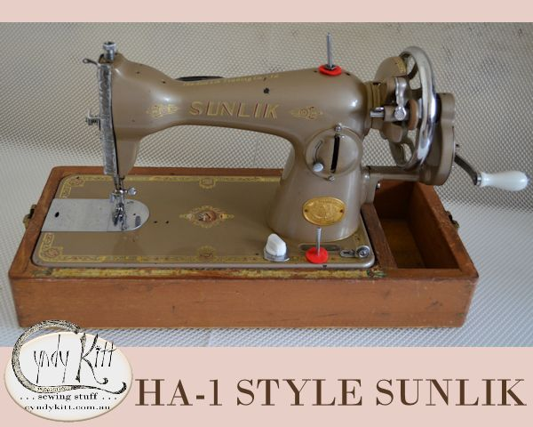
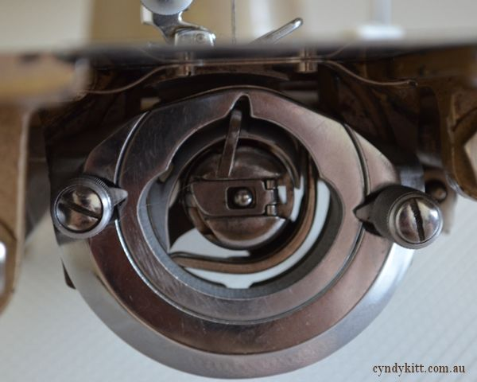
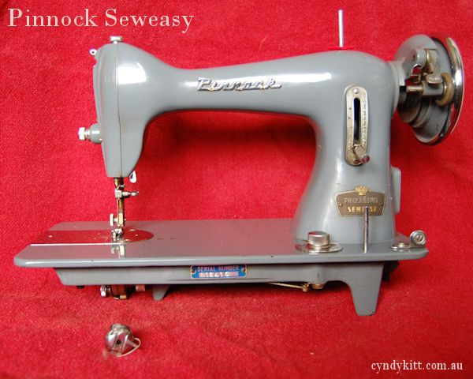
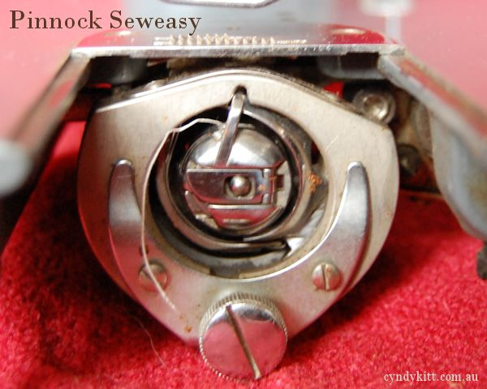

<table width="800" border="0" cellspacing="4" cellpadding="3" align="center">
<tr> 
<td colspan="2" height="62"> 

</td>
</tr>
<tr> 
<td width="174"></td>
<td width="602">

Suitable for many generic cast steel straight stitch domestic sewing 
machines manufactured after WWII in Japan as well as other parts of the 
world.  

There were a variety of stitch length controls, but they usually have 
one similar to the 15K88 (like the Palmer Princess above) or German models 
(like the Pinnock Seweasy at the bottom of the page)

All HA-1 models use a <a href="../pricelist/p02.htm">1 o'clock &quot;15 
class&quot; bobbin case:</a> 
 

</td>
</tr>
<tr> 
<td width="174"></td>
<td width="602">

 
and CB bobbins: 
 

 
 
Many have the easy release shuttle for cleaning and a feed dog drop control 
on the bed of the machine, but there are exceptions. 

</td>
</tr>
<tr> 
<td width="174">&nbsp;</td>
<td width="602"></td>
</tr>
<tr> 
<td colspan="2">

&nbsp;

</td>
</tr>
<tr> 
<td colspan="2"> 

 
<h6>Sunlik are a &quot;mystery&quot; brand but I suspect this machine 
was manufactured in Taiwan in the early 1970s 
 
 </h6>
<h6> 
Pinnock imported Japanese made CB (Central Bobbin) machines and put 
their own branding on them at their &quot;factory&quot; in Elizabeth, 
South Australia 
 
  
</h6>

</td>
</tr>
</table>

<!-- end container -->
