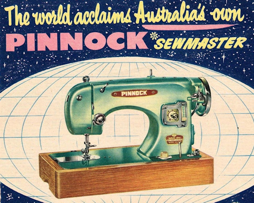

<!-- #BeginEditable "body2" --> 
<table width="800" border="0" cellspacing="4" cellpadding="3" align="center">
  <tr> 
    <td colspan="2" height="62"> 
      <h2>Advertisements for Pinnock Sewing Machines located at the QV Markets 
        George St Sydney first appeared in Sydney news papers around 1907</h2>
      
What is unknown about the early history of this Australian based retailer 
        and importer definitely outweighs what is known but in the 1920s and '30s, 
        they were among a number of significant sewing machine retailers in Australia. 
        Most of the machines they imported and &quot;badged&quot; with their Pinnock 
        branding in the early days appear to have come from a variety of German 
        manufacturers. 

    </td>
  </tr>
  <tr> 
    <td width="174"></td>
    <td width="602"> </td>
  </tr>
  <tr> 
    <td colspan="2"> 
      
 

    </td>
  </tr>
</table>

&nbsp;

&nbsp;

<!-- #EndEditable --> 

<a href="../a.main/shop.htm" target="_blank"></a>

<h4 align="center">This site requires java script to be enabled for easy navigation</h4>
</body>
<!-- #EndTemplate --></html>
