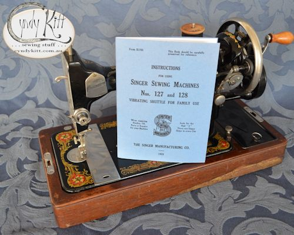

<table width="800" border="0" cellspacing="4" cellpadding="3" align="center">
<tr> 
<td height="62"> 

 

This Singer Instruction Manual was recreated from a carefully scanned, digitally repaired and reconstructed images and text from an original instructional booklet first printed in 1933. It is shown here with a Singer 128K hand crank manufactured in 1951.

The Singer 127 and 128 class are improved versions of the Singer 27 and 28, the main difference being that the tension on the 27 and 28 had a manual release, whereas the 127 and 128 class have an internal pin which releases the tension when the presser foot is raised. Please contact me if you need help identifying your machine 

The instructional text is the same as for the original documents and does reference charmingly obsolete terms and materials but is also very clear and easy to follow.

</td>
</tr>
<tr> 
<td> 

 

 

&nbsp;

</td>
</tr>
<tr> 
<td> 

This 32 page reproduction booklet (36 pages including cover) is A5 size (the original was 90mm&times;136mm) 

</td>
</tr>
<tr> 
<td> 

 
<h2>If you don't need to know about the attachments,  
this just covers the important stuff and I gave it a fresh cover design</h2>

</td>
</tr>
<tr> 
<td> 

This 16 page reproduction booklet (20 pages including cover) is A5 size

</td>
</tr>
<tr> 
<td height="80"> 

<h4><a href="{{ "stock/BOB-VS" | relative_url }}">More about VS shuttles and bobbins machines here</a></h4>

</td>
</tr>
</table>

<!-- end container -->
