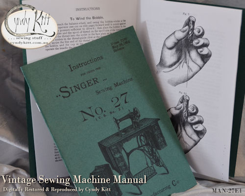

<table width="800" border="0" cellspacing="4" cellpadding="3" align="center">
<tr> 
<td width="602" height="62"> 
<h2 align="center">Combined Singer 27-2 and Attachments Instruction Book</h2>

  

</td>
</tr>
<tr> 
<td width="602"> 

This Singer Instruction Manual was compiled from carefully scanned, digitally repaired and reconstructed images and text from a pair of original booklets first printed in 1896 and supplied with a Singer 27-2 of that era but is a suitable manual for most Singer 27 and 28 sub-models as well as many other early era vibrating shuttle (long bobbin) machines (please <a href="{{ "a.main/contact" | relative_url }}">contact me</a> if you are unsure). 
 
The instructional text is the same as for the original documents and does reference charmingly obsolete terms and materials but is also very clear and easy to follow. I added the contents page for ease of use.

<h4>Contents:</h4>
<h5>PART ONE&#151;INSTRUCTIONS FOR USING THE 27-2 SEWING MACHINE</h5>
<ul>
<li> Oiling the Machine</li>
<li>Operating the Treadle and Machine</li>
<li>Setting the Needle</li>
<li>Threading the Needle</li>
<li>Winding the Bobbin</li>
<li>Threading the Shuttle</li>
<li>Preparing for Sewing</li>
<li>Regulating the Tensions</li>
<li>Altering Stitch Length</li>
<li>Adjusting Foot Pressure</li>
<li>Choosing Correct Thread and Needle</li>
<li>The Drop Cabinet</li>
<li>The Treadle Mechanism and Band Wheel</li>
<li>The New Singer Pitman (well new in 1884)</li>
</ul>

<h5>PART TWO&#151; INSTRUCTIONS FOR USING ATTACHMENTS (Style No. 14)  For use with Singer No. 15 and 27 Sewing Machines</h5>

 The Binder  The Hemmer  The Ruffler  The Tucker  The Under Braider

<b>This 28 page reproduction booklet (32 pages including cover) is A5 size (the originals were 145mm &times; 224mm)</b>

</td>
</tr>
<tr>
<td width="602">&nbsp;</td>
</tr>
<tr> 
<td width="602"> 

 
<h2>Singer 27-2 Instruction Book     </h2>
<h2 align="center">Part one of the above manual sold separately</h2>

 

This 16 page reproduction booklet (20 pages including cover) is A5 size (the originals were 145mm &times; 224mm)

</td>
</tr>
<tr> 
<td width="602">&nbsp; </td>
</tr>
<tr> 
<td width="602"> 
<h2 align="center">Style 14 Singer Attachment Instruction Book</h2>
<h2 align="center"></h2>
<h2 align="center"></h2>
<h2 align="center">&nbsp;</h2>
</td>
</tr>
<tr> 
<td width="602">

This 8 page reproduction booklet (12 pages including cover) is A5 size (the originals were 145mm &times; 224mm)

</td>
</tr>
<tr> 
<td valign="middle" height="80"> 

<h4><a href="{{ "stock/BOB-VS" | relative_url }}">More about VS shuttles and bobbins machines here</a></h4>

</td>
</tr>
</table>

