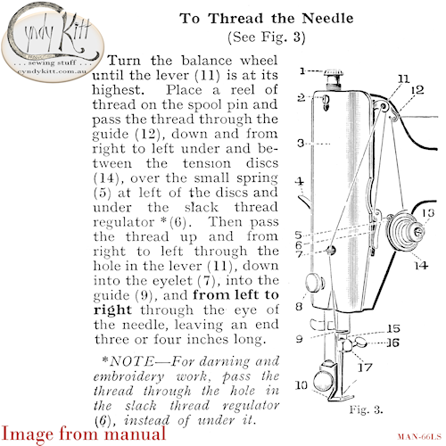
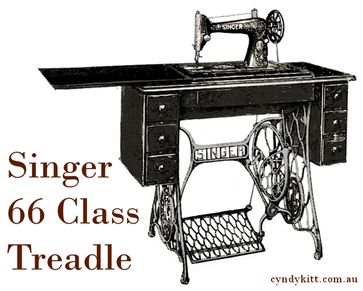

&nbsp;

<a href="{{ "machines/info-66-99" | relative_url }}">Singer 66 class</a> manual from the early 1930s with no alteration or editing to the original text except to this title page, exchanging the advert for a motor for a diagram of a treadle on page 2 and the information about needles on page 16 has been updated.  I have not included the second half of the manual which covers the attachments as I am still digitally cleaning these pages to my exacting standard.

&nbsp;

<!-- end row -->

The cover is also new and uses an image of a 66 class treadle from a Singer catalogue from the early 1930s.

This 16 page reproduction booklet (20 pages including cover) is A5 size (the original was 90mm&times;136mm)

