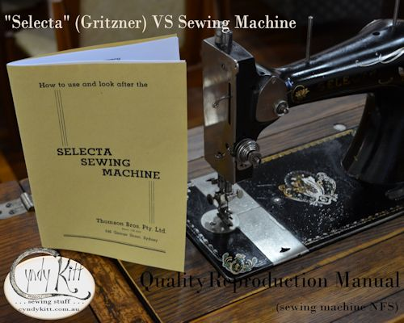

  

<!-- end col -->

Selecta was the house brand the Thompson Bros Dept store used for the machines they sold, regardless of make or model

<!-- end col -->

<!-- end row -->

Most of the machines they sold were manufactured in Germany by Gritzner.  This manual is for a Gritzner vibrating shuttle machine circa late 1920s early '30s.  Gritzner made a number of models, but this manual is suitable for most of the models which use this style of shuttle and bobbin:  German style VS Bobbin (new) 
Please note that I am not selling the original (which has been archived) but a faithful reproduction which has been carefully scanned, digitally repaired and reconstructed with no alteration to the original text. However, I have included a reproduction note and disclaimer. 

<!-- end col -->

 

<!-- end col -->

<!-- end row -->

<!-- end col -->

And <a href="{{ "stock/BOB-VS" | relative_url }}">if you require bobbins and/or shuttle, click here</a>.

<!-- end col -->

<!-- end row -->

The 16 page reproduction booklet (20 pages including cover) is A5 size (the original was 138mm &times; 205mm). 

<!-- end container -->
