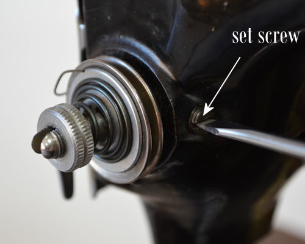

&nbsp;
<!-- end col -->

  

For the sake of convenience I will be using a 99K13 for this tutorial which has the same tension break down as the 66 class models you are likely to find in Australia.

<!-- end col -->

&nbsp;
<!-- end col -->

<!-- end row -->
  <h2>Breaking down an earlier model 66 and 99 class tension </h2>

&nbsp;

<!-- end col -->

A &#151; Check spring regulator 
B &#151; Check spring 
C &#151; Tension post 
D &#151; Tension release pin 
E &#151; Tension plates 
F &#151; Tension release disk 
G &#151; Beehive spring 
H &#151; Tension nut

<!-- end col -->

<!-- end row -->

<!-- end col -->

&nbsp;

<!-- end col -->

<!-- end row -->

<!-- end col -->

Loosen off the set screw to the side of the tension  (there is no need to remove completely)

<!-- end col -->

<!-- end row -->

<!-- end col -->

Remove the complete tension assembly from the machine

<!-- end col -->

<!-- end row -->

<!-- end col -->

Unscrew post from regulator

<!-- end col -->

<!-- end row -->

<!-- end col -->

&nbsp;

<!-- end col -->

<!-- end row -->

<!-- end col -->

&nbsp;

<!-- end col -->

<!-- end row -->

<!-- end col -->

&nbsp;

<!-- end col -->

<!-- end row -->

<!-- end col -->

&nbsp;

<!-- end col -->

<!-- end row -->

<!-- end col -->

Slip the new check spring over the end of the post and reverse the process

<!-- end col -->

<!-- end row -->

<!-- end col -->

Replace the tension with the presser foot in the down position (tension release inactivated) with the check spring angled to about 11 o'clock

<!-- end col -->

<!-- end row -->

<!-- end col -->

Tighten the set screw to the side of the tension and check the tension is released when the presser foot is raised

<!-- end col -->

<!-- end row -->

<!-- end container -->
