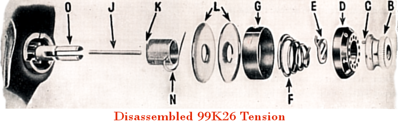

&nbsp; 

 

An easier way to replace the check spring  (AKA thread take-up spring)   on a Singer 99K26 through to 99K31

  

Most service instructions advise that the upper tension check spring be replaced from the front like the diagram above, however, I believe my method is simpler.

Breaking down a later model 99K26 through to 99K31 class tension 

&nbsp; 

A &#151; Check spring regulator 
B &#151; Check spring 
C &#151; Tension post 
D &#151; Tension release pin 
E &#151; Tension plates 
F &#151; Tension release disk 
G &#151; Beehive spring 
H2 &#151; Stop washer 
H1 &#151; Indicator dial 
H &#151; Tension nut

<!-- end col -->

<!-- end row -->

<!-- end container -->

<!-- end col -->

&nbsp; 

<!-- end row -->

&nbsp; 

Comparing the check springs from early and later model 99 class  The #32758 is no longer in production, but the <a href="{{ "pricelist/p04.html" | relative_url }}" >#32575</a> can be used if you follow my instructions

&quot;A&quot; is a new check spring made in Taiwan to the specs for the Singer part # 32575 (the check spring required for early model 66 and 99 class machines. &quot;B&quot; is Singer part # 32758 taken from a later style 99K.

<iframe width="800" height="480" src="https://www.youtube.com/embed/jJR2FV4-7bY" frameborder="0" allowfullscreen></iframe>

Loosen off the set screw to the side of the tension  (there is no need to remove completely)

<!-- end col -->

<!-- end row -->

<!-- end container -->

Remove the complete tension assembly from the machine

<!-- end col -->

<!-- end row -->

&nbsp;

<!-- end col -->

<!-- end row -->

&nbsp;

Loosen off the cap screw  (there is no need to remove completely) 

<!-- end col -->

<!-- end row -->

<!-- end container -->

<!-- end col -->

&nbsp; 

<!-- end row -->

<!-- end container -->

Pull the check spring regulator from the main tension, then slide off the check spring.

<h6 align="left">Part #32757   (complete tension)</h6>
<h6 align="left">Part # 32758   (original check spring)</h6>
<h6 align="left">Part #32759   (check spring regulator)</h6>

Check spring #32758 original but slightly bent out of shape, still okay, but a really damaged spring will need replacing

Note the position of the spring

If the tail of the #32575 check spring curls around on itself like this, it is a good idea to trim about 5mm off with a pair of side cutters

Note the position of the spring

The check spring regulator may not sit flush with the end of the tension stud if you don't trim the #32575 check spring, and this may affect the effectiveness of the tension release pin (the 25mm long rod which runs up the centre of the tension stud).

This is how you want it to look, check the spring moves freely

Retighten the cap screw when it looks correct

The top of the regulator slot should sit about even with the end of the minus sign on the tension indicator and the arm of the spring should rest against the top of the slot

Replace the tension with the presser foot in the down position (tension release inactivated) and ensure the centre mark is at 12 o'clock

Tighten the set screw to the side of the tension and check the tension is released when the presser foot is raised

