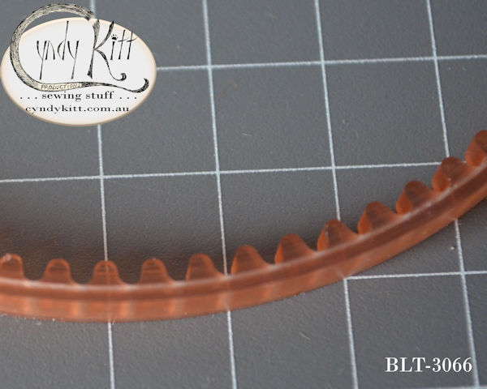

<h2>Suitable for use with the solid balance wheel fitted to most belt drive Singers with an external (bolt on) motor, such as:</h2>

&nbsp;

<!-- end inner col 1 -->

<ul>
<li> <h2>15 class</h2> </li>
<li> <h2>27 class</h2> </li>
<li> <h2>28 class</h2> </li>
<li> <h2>66 class</h2> </li>
<li> <h2>99 class</h2> </li>
<li> <h2>201 class</h2> </li>
<li> <h2>206 class</h2> </li>
<li> <h2>306 class etc  </h2> </li>
</ul>

<!-- end inner col 2 -->

<!-- end inner row -->

<!-- end inner container -->

<!-- end col -->

<!-- end row -->

<h2>Fitted to a 99K30</h2>

<h2>For current pricing see my <a href="{{ "pricelist/p01" }}" >catalogue</a> </h2>

<!-- end container -->
