<table width="800" border="0" cellspacing="4" cellpadding="3" align="center">
  <tr> 
    <td height="62" colspan="2"> 
      <h2 align="center">Superior quality Taiwanese made chrome metal &quot;172222&quot; 
        bobbins </h2>
      <h3 align="center">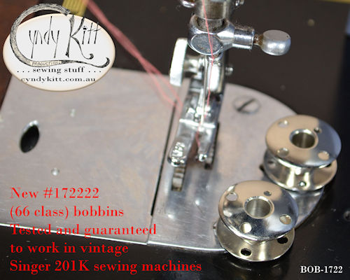 
        If your vintage Singer has a drop in style bobbin, then chances are it 
        takes this bobbin.</h3>
      
According to my supplier this bobbin is suited to the following Singer 
        models: 
        <a href="../machines/info-66-99.htm">66, 99, 185</a>, 192, <a href="../machines/info-201.htm">201</a>, 
        242, 247, 248, 252, 257, 258, 259, 285, 292, 327, 328, 329, 337, 338, 
        353, 354, 360, 362, 367, 368, 401, 403, 404, 413, 416, 417, 418, 457, 
        466, 476, 477, 478, 500, 502, 503, 507, 509, 513, 514, 518, 522, 527, 
        533, 534, 538, 560, 734, 774, 776.

      <h4>I have personally tested them in 66, 99, 201 and 401 class machines. 
        They are of superior quality to the first &#147;66&#148; class bobbins 
        I stocked which proved unsuitable for machines with the early style Singer 
        bobbin winder (the gripper hole is too far from the spindle hole) and 
        customers with 1960s slant needle models have also been thrilled with 
        them as the little ridge on the cheaper bobbins can interfere with performance. 
      </h4>
      
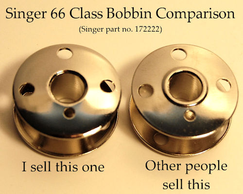 
         
        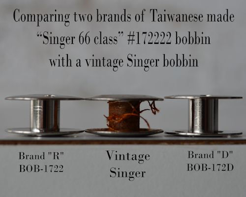  
      

    </td>
  </tr>
  <tr> 
    <td colspan="2"> </td>
  </tr>
  <tr> 
    <td width="382"> 
      
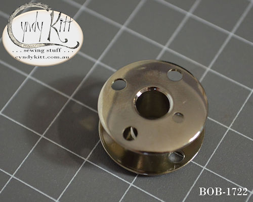

    </td>
    <td width="394"> 
      
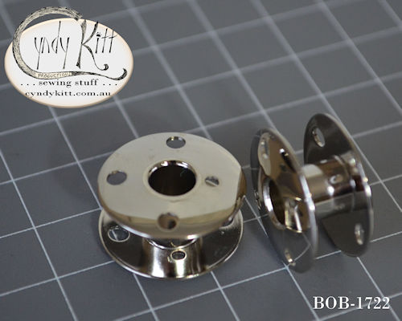

      </td>
  </tr>
  <tr>
    <td width="382">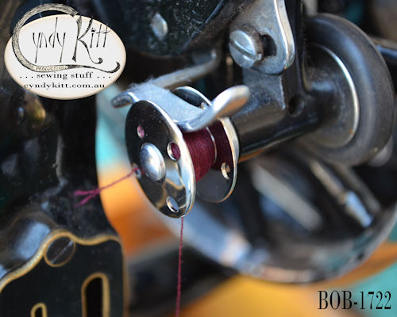</td>
    <td width="394">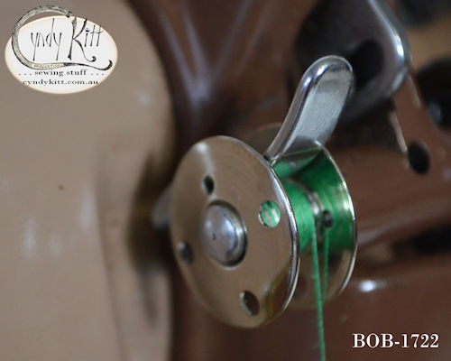</td>
  </tr>
  <tr>
    <td width="382"></td>
    <td width="394">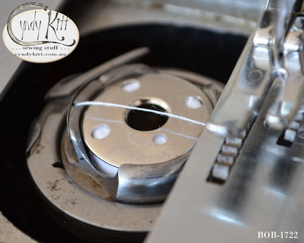</td>
  </tr>
  <tr>
    <td width="382">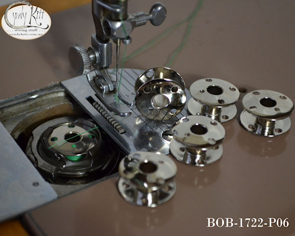</td>
    <td width="394">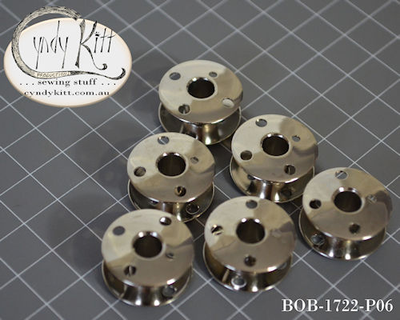</td>
  </tr>
  <tr>
    <td width="382">&nbsp;</td>
    <td width="394">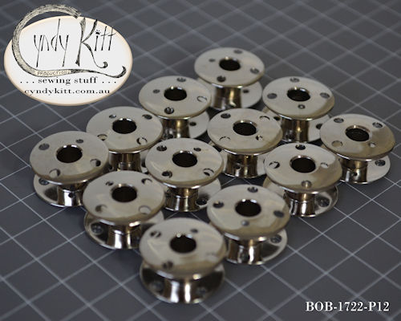</td>
  </tr>
  <tr>
    <td width="382">&nbsp;</td>
    <td width="394">&nbsp;</td>
  </tr>
  <tr>
    <td width="382">&nbsp;</td>
    <td width="394">&nbsp;</td>
  </tr>
</table>
<!-- #EndEditable --> 

 
  <form name="form1">
    <select name="Price List" onChange="MM_jumpMenu('parent',this,0)">
      <option value="../pricelist/index.htm" selected>Price List Index</option>
      <option value="../pricelist/p01.htm">Belts, Balance Wheels, Hand 
      Cranks & Electric Motors</option>
      <option value="../pricelist/p02.htm">Shuttles, Bobbin Cases & Bobbins</option>
      <option value="../pricelist/p03.htm">Slide & Throat Plates</option>
      <option value="../pricelist/p04.htm">Tension Parts</option>
      <option value="../pricelist/p05.htm">Feet & Attachments</option>
      <option value="../pricelist/p06.htm">Needles</option>
      <option value="../pricelist/p07.htm">Useful Bits</option>
      <option value="../pricelist/p08.htm">Treadle & Cabinet Parts</option>
      <option value="../pricelist/p09.htm">Tools</option>
      <option value="../manuals/index.htm">Manuals</option>
    </select>
    <input type="button" name="Button1" value="Go" onClick="MM_jumpMenuGo('Price List','parent',0)">
  </form>
  
&nbsp;

  
<a href="../a.main/shop.htm" target="_blank"></a>

<h5 align="center">Cyndy Kitt Productions items are also available from 
  <a href="http://www.annebonnyslocker.com.au">Anne Bonny's Locker</a> </h5>
</body>
<!-- #EndTemplate --></html>
