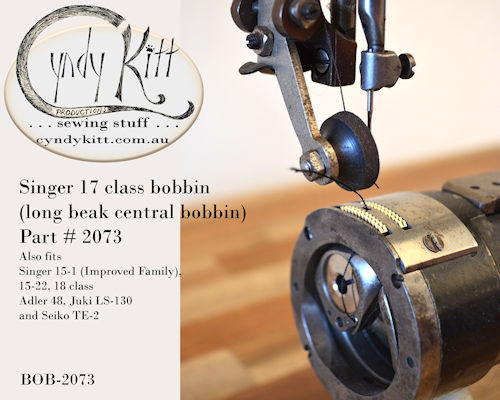

  15-1 circa late 1880s

  15-1 circa early 1890s with 1950s refurbish

Suitable for Singer Models 15-1, 15-22  and 

Singer industrial 17 and 18 Class Vamping Machines 

According to my supplier this bobbin should also fit Adler 48, Juki LS-130 and Seiko TE-2 

The Model 15-1 (patented 1878 and designed by Singer employees Philip Diehl and Lebbeus Miller) was originally sold as an &quot;Improved Family&quot; and introduced oscillating shuttle

If you have a vintage long beak shuttle machine such as the 15-1 and 15-22 you probably haven't had much luck finding a retail suppler for the correct bobbins and may have even given up hope, well I have done the detective work and found a supplier who makes the bobbin you need.  

For current pricing check my <a href="{{ "pricelist/p02" | relative_url }}">catalogue</a>

<!-- end container -->
