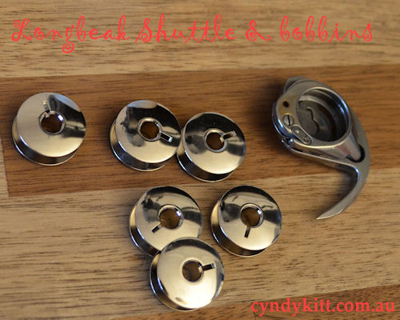

<!-- #BeginEditable "body2" --> 
<table width="800" border="0" cellspacing="4" cellpadding="3" align="center">
  <tr> 
    <td colspan="2" height="62"> 
      <h6 align="center"> 
        15-1 circa late 1880s</h6>
      <h6 align="center"> 
        15-1 circa early 1890s with 1950s refurbish</h6>
      <h2 align="center">Suitable for Singer Models 15-1, 15-22 
        and </h2>
      <h2 align="center"></h2>
      <h2 align="center">Singer industrial 17 and 18 Class Vamping Machines 
        </h2>
      
According to my supplier this bobbin should also fit Adler 
        48, Juki LS-130 and Seiko TE-2 

    </td>
  </tr>
  <tr> 
    <td width="174"></td>
    <td width="602"> 
      
The Model 15-1 (patented 1878 and designed by Singer employees Philip 
        Diehl and Lebbeus Miller) was originally sold as an &quot;Improved Family&quot; 
        and introduced oscillating shuttle

      
If you have a vintage long beak shuttle machine such as the 15-1 and 
        15-22 you probably haven't had much luck finding a retail suppler for 
        the correct bobbins and may have even given up hope, well I have done 
        the detective work and found a supplier who makes the bobbin you need. 
      

    </td>
  </tr>
  <tr> 
    <td colspan="2"> 
      

        

        

        

        
For current pricing check my <a href="../pricelist/p02.htm">catalogue</a>

      

    </td>
  </tr>
</table>
<!-- #EndEditable --> 

 
  <form name="form1">
    <select name="Price List" onChange="MM_jumpMenu('parent',this,0)">
      <option value="../pricelist/index.htm" selected>Price List Index</option>
      <option value="../pricelist/p01.htm">Belts, Balance Wheels, Hand 
      Cranks & Electric Motors</option>
      <option value="../pricelist/p02.htm">Shuttles, Bobbin Cases & Bobbins</option>
      <option value="../pricelist/p03.htm">Slide & Throat Plates</option>
      <option value="../pricelist/p04.htm">Tension Parts</option>
      <option value="../pricelist/p05.htm">Feet & Attachments</option>
      <option value="../pricelist/p06.htm">Needles</option>
      <option value="../pricelist/p07.htm">Useful Bits</option>
      <option value="../pricelist/p08.htm">Treadle & Cabinet Parts</option>
      <option value="../pricelist/p09.htm">Tools</option>
      <option value="../manuals/index.htm">Manuals</option>
    </select>
    <input type="button" name="Button1" value="Go" onClick="MM_jumpMenuGo('Price List','parent',0)">
  </form>
  
&nbsp;

  
<a href="../a.main/shop.htm" target="_blank"></a>

<h5 align="center">Cyndy Kitt Productions items are also available from 
  <a href="http://www.annebonnyslocker.com.au">Anne Bonny's Locker</a> </h5>
</body>
<!-- #EndTemplate --></html>
