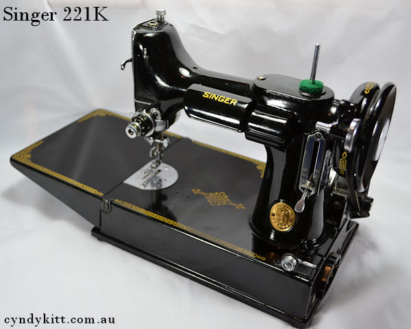
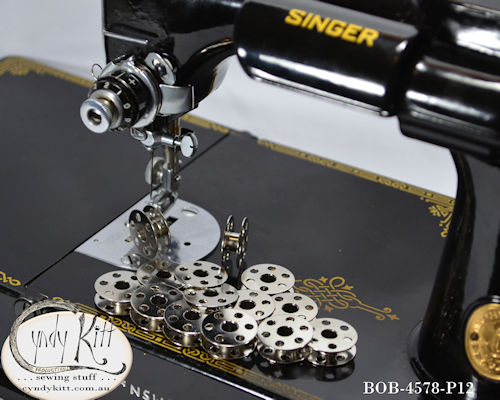
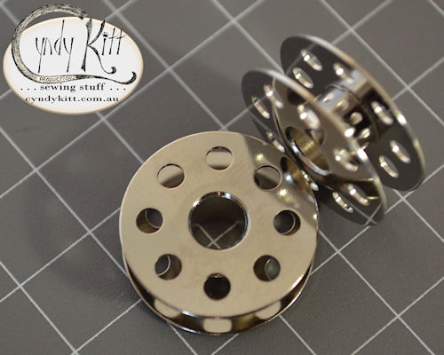
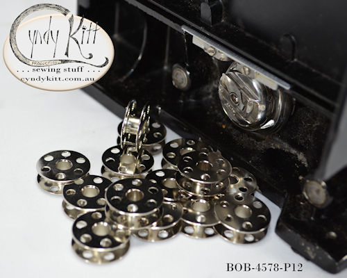
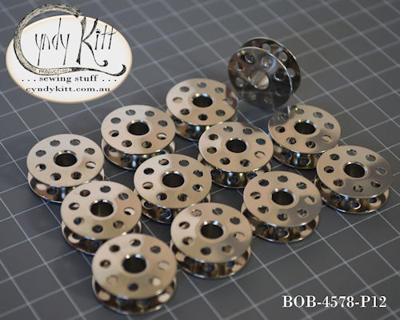

<table width="800" border="0" cellspacing="4" cellpadding="3" align="center">
  <tr> 
    <td colspan="2" height="62"> 
      <h2 align="left">Suitable for 
        Singer models: 221, 222, 301</h2>
      <h2 align="center"></h2>
      <h2 align="left">Bernina models: 117, 217, 540, 640 
        These Taiwanese made bobbins have been tested in my own Singer 221 (pictured) 
        and they work a treat. 
        This evaluation has been mirrored by every one of my customers who has 
        purchased them. 
        While these bobbins also work in the Bernina models mentioned, there may 
        be issues with winding as they lack the gripper slot most Bernina models 
        require.</h2>
      <h2 align="center"></h2>
    </td>
  </tr>
  <tr> 
    <td width="386"></td>
    <td width="390"> 
      

    </td>
  </tr>
  <tr> 
    <td width="386"> 
      

    </td>
    <td width="390"></td>
  </tr>
  <tr>
    <td width="386">&nbsp;</td>
    <td width="390">&nbsp;</td>
  </tr>
  <tr>
    <td width="386">&nbsp;</td>
    <td width="390">&nbsp;</td>
  </tr>
  <tr>
    <td width="386">&nbsp;</td>
    <td width="390">&nbsp;</td>
  </tr>
</table>
<!-- #EndEditable --> 

 
  <form name="form1">
    <select name="Price List" onChange="MM_jumpMenu('parent',this,0)">
      <option value="../pricelist/index.htm" selected>Price List Index</option>
      <option value="../pricelist/p01.htm">Belts, Balance Wheels, Hand 
      Cranks & Electric Motors</option>
      <option value="../pricelist/p02.htm">Shuttles, Bobbin Cases & Bobbins</option>
      <option value="../pricelist/p03.htm">Slide & Throat Plates</option>
      <option value="../pricelist/p04.htm">Tension Parts</option>
      <option value="../pricelist/p05.htm">Feet & Attachments</option>
      <option value="../pricelist/p06.htm">Needles</option>
      <option value="../pricelist/p07.htm">Useful Bits</option>
      <option value="../pricelist/p08.htm">Treadle & Cabinet Parts</option>
      <option value="../pricelist/p09.htm">Tools</option>
      <option value="../manuals/index.htm">Manuals</option>
    </select>
    <input type="button" name="Button1" value="Go" onClick="MM_jumpMenuGo('Price List','parent',0)">
  </form>
  
&nbsp;

  
<a href="../a.main/shop.htm" target="_blank"></a>

<h5 align="center">Cyndy Kitt Productions items are also available from 
  <a href="http://www.annebonnyslocker.com.au">Anne Bonny's Locker</a> </h5>
</body>
<!-- #EndTemplate --></html>
