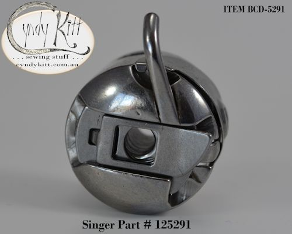
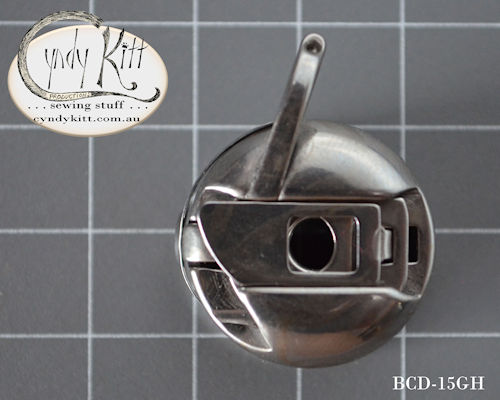

<!-- #BeginEditable "body2" --> 
<table width="800" border="0" cellspacing="4" cellpadding="3" align="center">
  <tr> 
    <td colspan="2" height="62"> 
      <h3>Despite being most associated with the <a href="../machines/info-15.htm">Singer 
        15 class</a>, there is evidence that &quot;central bobbin&quot; oscillating 
        hook shuttle for lock stitch system was most likely developed by a German 
        manufacturer in the late 1880s. </h3>
      
There is evidence that the Singer Manufacturing Co stole the design for 
        a fingered bobbin case vertical oscillating shuttle from D&uuml;rkopp 
        in the 1880s but other than some unverifiable references to a drawn out 
        patent case concrete records are rather murky on the matter. Whatever 
        the truth of the matter, it does appear that the shuttle system was treated 
        at public domain by the first decade of the 20th century with most German 
        sewing machine manufacturers producing models using the shuttle, commonly 
        referred to as a Central Bobbin or CB, for domestic and commercial use 
        by 1910. 

      
The #2581 and #2996 bobbins are suitable for all central bobbin models, 
        the non-Singer central bobbins with the exception of the Soviet Union 
        made machines all require 1 o'clock shuttle 

      
Singer also used the shuttle system for commercial and industrial use 
        models, along with the 16 there was the <a href="BOB-9120.htm">31</a> 
        (albeit with a slightly different bobbin case) and several industrial 
        use 15 class models.

    </td>
  </tr>
  <tr> 
    <td></td>
    <td></td>
  </tr>
  <tr> 
    <td></td>
    <td></td>
  </tr>
  <tr> 
    <td> 
      <h3>The Singer <a href="../manuals/MAN-15K26.htm">15K26</a> and 15K80  
        and all non-Singer CB models use a 1 o'clock case </h3>
    </td>
    <td> 
      <h3 align="right">The Singer 15K88 through to 15K90 
        require an 11 o'clock case</h3>
    </td>
  </tr>
  <tr> 
    <td> 
      

      
Bobbin Case for straight stitch &quot;central bobbin&quot; oscillating 
        hook machines  
        (1 o'clock, Singer part # 15277)  
        <b>Currently not available from my suppliers</b> 
        Please order either of the following cases 
        BCD-15GH 
        BCD-HZ11 

    </td>
    <td valign="top"> 
    </td>
  </tr>
  <tr> 
    <td width="174" height="62" valign="top"> 
      <h3></h3>
    </td>
    <td width="602" height="62"> 
      

    </td>
  </tr>
  <tr> 
    <td width="174"></td>
    <td width="602"> 
    </td>
  </tr>
  <tr> 
    <td> 
      

    </td>
    <td>&nbsp;</td>
  </tr>
  <tr> 
    <td></td>
    <td></td>
  </tr>
  <tr> 
    <td></td>
    <td></td>
  </tr>
  <tr> 
    <td>&nbsp;</td>
    <td>&nbsp;</td>
  </tr>
  <tr> 
    <td>&nbsp;</td>
    <td>&nbsp;</td>
  </tr>
  <tr> 
    <td colspan="2"> 
      

    </td>
  </tr>
  <tr> 
    <td></td>
    <td></td>
  </tr>
  <tr> 
    <td>&nbsp;</td>
    <td>&nbsp;</td>
  </tr>
  <tr> 
    <td></td>
    <td></td>
  </tr>
  <tr> 
    <td>&nbsp;</td>
    <td>&nbsp;</td>
  </tr>
  <tr> 
    <td>&nbsp;</td>
    <td>&nbsp;</td>
  </tr>
  <tr> 
    <td></td>
    <td></td>
  </tr>
  <tr> 
    <td></td>
    <td>&nbsp;</td>
  </tr>
  <tr> 
    <td colspan="2">&nbsp;</td>
  </tr>
</table>
<!-- #EndEditable --> 

 
  <form name="form1">
    <select name="Price List" onChange="MM_jumpMenu('parent',this,0)">
      <option value="../pricelist/index.htm" selected>Price List Index</option>
      <option value="../pricelist/p01.htm">Belts, Balance Wheels, Hand 
      Cranks & Electric Motors</option>
      <option value="../pricelist/p02.htm">Shuttles, Bobbin Cases & Bobbins</option>
      <option value="../pricelist/p03.htm">Slide & Throat Plates</option>
      <option value="../pricelist/p04.htm">Tension Parts</option>
      <option value="../pricelist/p05.htm">Feet & Attachments</option>
      <option value="../pricelist/p06.htm">Needles</option>
      <option value="../pricelist/p07.htm">Useful Bits</option>
      <option value="../pricelist/p08.htm">Treadle & Cabinet Parts</option>
      <option value="../pricelist/p09.htm">Tools</option>
      <option value="../manuals/index.htm">Manuals</option>
    </select>
    <input type="button" name="Button1" value="Go" onClick="MM_jumpMenuGo('Price List','parent',0)">
  </form>
  
&nbsp;

  
<a href="../a.main/shop.htm" target="_blank"></a>

<h5 align="center">Cyndy Kitt Productions items are also available from 
  <a href="http://www.annebonnyslocker.com.au">Anne Bonny's Locker</a> </h5>
</body>
<!-- #EndTemplate --></html>
