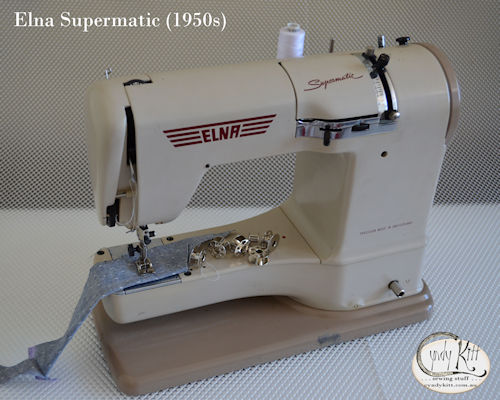
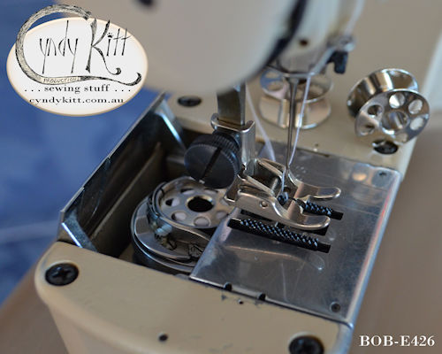
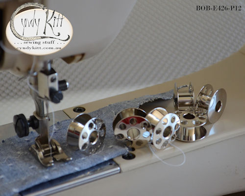
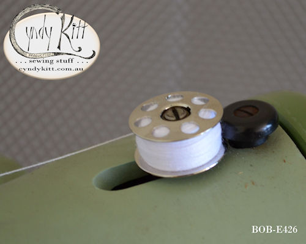
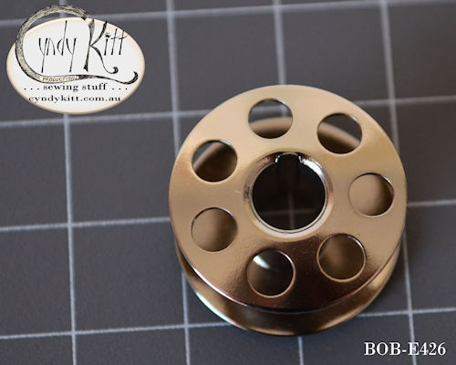
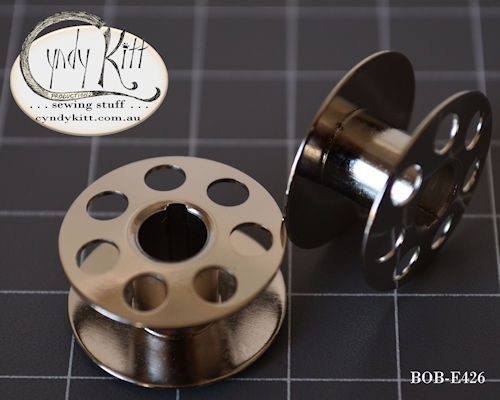
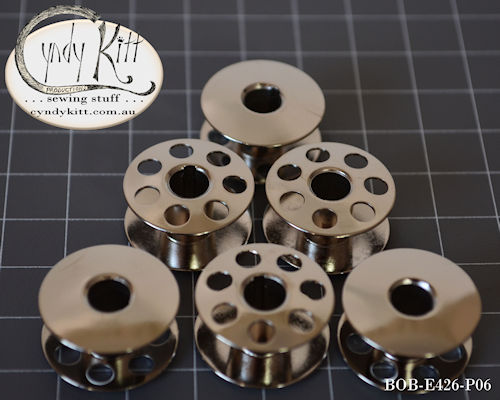
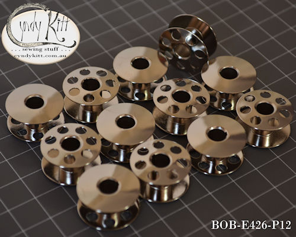

<!-- #BeginEditable "body2" --> 
<table width="800" border="0" cellspacing="4" cellpadding="3" align="center">
  <tr> 
    <td height="62" colspan="2"> 
      <h2>Metal bobbin fits Elna Models: 
      </h2>
      <h2 align="center"> 
          
          
         </h2>
      <h2 align="left">Supermatic (as pictured, and this is the model I have tested 
        them in) 
        According to my supplier, the 426000 is the correct bobbin for the following 
        machines but I don&#146;t have any real experience with these models so 
        can&#146;t verify. 
        Grasshopper  
        TSP &amp; Star: 11, 13, 21, 23, 31, 33, 41, 43, 62, 64, 72, 74, 
        Lotus: 14, 22, 24, 32, 34, 35, 36, 52 
        Stella: 17, 22, 27, 37, 57 
        Carina: 45, 46, 55, 56, 65, 66 
        Jubilee Air Electronic: 38, 39, 58, 59, 68, 69</h2>
    </td>
  </tr>
  <tr> 
    <td colspan="2"> </td>
  </tr>
  <tr> 
    <td width="386"></td>
    <td width="390"></td>
  </tr>
  <tr> 
    <td width="386"></td>
    <td width="390"></td>
  </tr>
  <tr> 
    <td colspan="2">&nbsp;</td>
  </tr>
</table>
<!-- #EndEditable --> 

 
  <form name="form1">
    <select name="Price List" onChange="MM_jumpMenu('parent',this,0)">
      <option value="../pricelist/index.htm" selected>Price List Index</option>
      <option value="../pricelist/p01.htm">Belts, Balance Wheels, Hand 
      Cranks & Electric Motors</option>
      <option value="../pricelist/p02.htm">Shuttles, Bobbin Cases & Bobbins</option>
      <option value="../pricelist/p03.htm">Slide & Throat Plates</option>
      <option value="../pricelist/p04.htm">Tension Parts</option>
      <option value="../pricelist/p05.htm">Feet & Attachments</option>
      <option value="../pricelist/p06.htm">Needles</option>
      <option value="../pricelist/p07.htm">Useful Bits</option>
      <option value="../pricelist/p08.htm">Treadle & Cabinet Parts</option>
      <option value="../pricelist/p09.htm">Tools</option>
      <option value="../manuals/index.htm">Manuals</option>
    </select>
    <input type="button" name="Button1" value="Go" onClick="MM_jumpMenuGo('Price List','parent',0)">
  </form>
  
&nbsp;

  
<a href="../a.main/shop.htm" target="_blank"></a>

<h5 align="center">Cyndy Kitt Productions items are also available from 
  <a href="http://www.annebonnyslocker.com.au">Anne Bonny's Locker</a> </h5>
</body>
<!-- #EndTemplate --></html>
