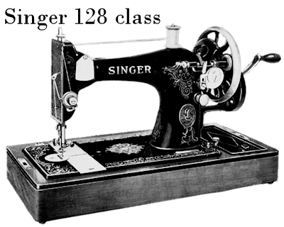
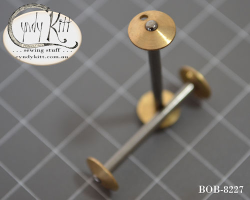
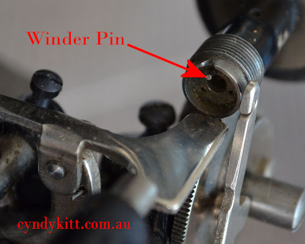

<!-- #BeginEditable "body2" --> 
<table width="800" border="0" cellspacing="4" cellpadding="3" align="center">
  <tr> 
    <td colspan="2" height="62"> 
      
 
        

        

        <h4>The Three-Quarter Size Singer 28 and 128 Hand Crank Models</h4>
      

    </td>
  </tr>
  <tr> 
    <td colspan="2" valign="top"> 
      <h2>The Shuttle</h2>
      <h3>The only &quot;VS&quot; shuttle still in commercial production is the 
        one meant for the Singer 127 and 128 class Singer part #83505</h3>
      
The #83505 shuttle is cross compatible with the earlier #08327 Singer 
        27 and 28 class, and just as was the situation with Central Bobbin (CB) 
        bobbin cases, the specifications came to be the industry standard, albeit 
        not a universal standard. 

      
The shape of the shuttle is primarily governed by the swing of the shuttle 
        arm and the position of the pivot point. To learn more about <a href="../machines/VSPP.htm">Pivot 
        Point Identification</a> please read <a href="../machines/VSPP.htm">this 
        page</a>.

    </td>
  </tr>
  <tr> 
    <td width="174"> 
      

    </td>
    <td width="602"> 
      

    </td>
  </tr>
  <tr> 
    <td width="174"> 
      

    </td>
    <td width="602"> 
      

    </td>
  </tr>
  <tr> 
    <td width="174">&nbsp;</td>
    <td width="602">&nbsp;</td>
  </tr>
  <tr> 
    <td colspan="2"> 
      
 
        <h4> 
          Diagram and text from an unidentified German VS Manual</h4>
        
&nbsp;

      

    </td>
  </tr>
  <tr> 
    <td colspan="2"> 
      
 
        <h4> 
          Selection of VS bobbins</h4>
      

    </td>
  </tr>
  <tr> 
    <td width="174" valign="top"> 
      <h2> comparison photo  
      </h2>
      <h4>&quot;A&quot; is a new Taiwanese made VS bobbin 
        &quot;B&quot; is an original Singer bobbin 
        &quot;C&quot; is a new VS bobbin I sourced from China 
        &quot;H&quot; is from a New Home 
        &quot;W&quot; is from a White</h4>
      <h4>&nbsp;</h4>
      
Unfortunately there are no modern commercially made equivalents for the 
        extra long bobbins used by New Home and Davis or the short hallow VS bobbins 
        used by White.

    </td>
    <td width="602" valign="bottom"> 
      

    </td>
  </tr>
  <tr valign="bottom"> 
    <td width="174"> 
      <h3>New Vibrating Shuttle (long) Bobbins made to suit German designed VS 
        (vibrating shuttle) model sewing machines such as Gritzner Selecta, Frister 
        and Rossmann, Anker Regia, Mundlos and several of the models Bebarfald's 
        Dept Store badged as a Blue-Bird </h3>
      <h3>&nbsp;</h3>
      <h3 align="center"></h3>
    </td>
    <td width="602"> 
      
Finally, after a six year search I have tracked down new 
        Chinese made VS bobbins in the German style with the little hole for the 
        winder pin, as well as the above German made models, there were several 
        non-Singer British and US models that feature the gripper pin on the winder. 
        The bobbins are 34mm long with a solid steel shaft and brass ends, and 
        they will also fit the Singer VS models, technically both the bobbin I 
        have stocked for some years this one share the #8228 manufacturers part 
        number (originally designated by Singer in the 1880s) but in my personal 
        stock listings I am designating this one BOB-8227 (the former I designated 
        BOB-8228) for differentiation purposes.

    </td>
  </tr>
  <tr valign="bottom">
    <td width="174"></td>
    <td width="602"></td>
  </tr>
  <tr valign="bottom">
    <td width="174">&nbsp;</td>
    <td width="602">&nbsp;</td>
  </tr>
  <tr> 
    <td colspan="2"> 
      

      <h2 align="center">BELOW 
        Close up of the winder pin on a Gritzner VS</h2>
    </td>
  </tr>
  <tr> 
    <td colspan="2"> 
      
 
        

    </td>
  </tr>
  <tr> 
    <td colspan="2"> 
      <h3>Pack of Six or a Dozen New Vibrating Shuttle (long) Bobbins:</h3>
      
made to suit German designed VS (vibrating shuttle) model sewing machines 
        such as Gritzner Selecta, Frister and Rossmann, Anker Regia, Mundlos and 
        several of the models Bebarfald's Dept Store badged as a Blue-Bird

    </td>
  </tr>
  <tr> 
    <td width="174"></td>
    <td width="602"></td>
  </tr>
  <tr> 
    <td width="174"></td>
    <td width="602" valign="top"> 
      <h3>The Taiwanese made VS bobbin sold as a #8228 really should be sold as 
        a #510 Japanese VS bobbin</h3>
      
That's is right, there were a number of Japanese VS models made in the 
        1950s and '60s, including zigzag models. From what I understand these 
        machines were mostly made to show the superiority of the CB shuttle system, 
        I have not had personal direct experience with a Japanese VS. The photo 
        to the right was supplied by a Canadian collector.

    </td>
  </tr>
  <tr> 
    <td width="174"> 
      

    </td>
    <td width="602"> 
      

    </td>
  </tr>
  <tr> 
    <td width="174"> 
      

    </td>
    <td width="602"> 
      

    </td>
  </tr>
  <tr> 
    <td colspan="2">
      <h4>As the distance between the end caps on the Taiwanese version of the 
        8228 VS bobbin is a smidge smaller than the Singer bobbin you may find 
        it winds to heavilly to the left and you may have to manually correct 
        for this. </h4>
    </td>
  </tr>
  <tr> 
    <td width="174"> 
      <h2 align="center">BOB-8228</h2>
      
Exactly the same as the BOB-822C but with brass rather 
        than copper ends.

      

      

    </td>
    <td width="602"> 
      <h2 align="center">BOB-822C</h2>
      
Exactly the same as the BOB-8228 but with copper rather 
        than brass ends.

      

      

    </td>
  </tr>
  <tr> 
    <td width="174"> 
      <h2 align="center"></h2>
    </td>
    <td width="602"> 
      <h2 align="center"></h2>
    </td>
  </tr>
  <tr> 
    <td width="174"> 
      

    </td>
    <td width="602"> 
      

    </td>
  </tr>
  <tr> 
    <td width="174">&nbsp;</td>
    <td width="602">&nbsp;</td>
  </tr>
  <tr> 
    <td colspan="2"> 
      
For current pricing <a href="../pricelist/p02.htm">CLICK 
        HERE</a>

    </td>
  </tr>
</table>

<!-- #EndEditable --> 

 
  <form name="form1">
    <select name="Price List" onChange="MM_jumpMenu('parent',this,0)">
      <option value="../pricelist/index.htm" selected>Price List Index</option>
      <option value="../pricelist/p01.htm">Belts, Balance Wheels, Hand 
      Cranks & Electric Motors</option>
      <option value="../pricelist/p02.htm">Shuttles, Bobbin Cases & Bobbins</option>
      <option value="../pricelist/p03.htm">Slide & Throat Plates</option>
      <option value="../pricelist/p04.htm">Tension Parts</option>
      <option value="../pricelist/p05.htm">Feet & Attachments</option>
      <option value="../pricelist/p06.htm">Needles</option>
      <option value="../pricelist/p07.htm">Useful Bits</option>
      <option value="../pricelist/p08.htm">Treadle & Cabinet Parts</option>
      <option value="../pricelist/p09.htm">Tools</option>
      <option value="../manuals/index.htm">Manuals</option>
    </select>
    <input type="button" name="Button1" value="Go" onClick="MM_jumpMenuGo('Price List','parent',0)">
  </form>
  
&nbsp;

  
<a href="../a.main/shop.htm" target="_blank"></a>

<h5 align="center">Cyndy Kitt Productions items are also available from 
  <a href="http://www.annebonnyslocker.com.au">Anne Bonny's Locker</a> </h5>
</body>
<!-- #EndTemplate --></html>
