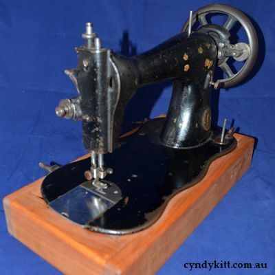
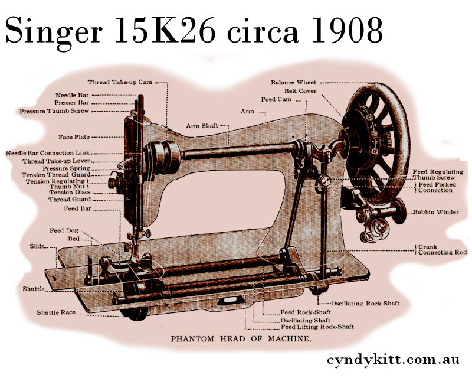

<table width="800" border="0" cellspacing="4" cellpadding="3" align="center">
  <tr> 
    <td colspan="2" height="62"> 
      <h2>Short history of the Model 15</h2>
      
Philip H. Diehl invented the oscillating central bobbin (CB) shuttle 
        for Singer in the late 1870s, and this was the basis of the Singer 15 
        class with the introduction of the 15-1 (AKA Improved Family) in 1879 
        a number of industrial models (17 and 18 class for shoe making as well 
        as a number of 15 subclasses for specific garment industry applications). 
        The fingered bobbin case for the oscillating hook was developed and patented 
        in 1887, and this became the dominant bobbin, bobbin case and shuttle 
        system for domestic machines in the 20th century after the Singer patent 
        for the CB shuttle expired 20 years later. 
        By the 1920s, many of Singer's competitors-Pfaff (Model 31), Gritzner 
        and many others in Germany, Brother (Model HA-1) in Japan-had incorporated 
        the central bobbin shuttle in their models, and most companies offered 
        a number of improvements to give them a competitive edge; Singer had the 
        momentum of being the dominant brand and did not need to be innovative 
        to sell machines but they did reinvent the wheel (so to speak) with the 
        15-88/15K88 (and the rest of the subclass family which only differs in 
        how it is powered; 88 treadle, 89 being hand crank, 90 belt driven motor 
        and 91 being the potted motor) in the early 1930s. For those who are unaware, 
        &quot;K&quot; just means the machine was made at the Kilbowie factory 
        in Scotland.

    </td>
  </tr>
  <tr> 
    <td width="800"> 
      
 
         

    </td>
    <td width="500" valign="top"> 
      
The 15-1, or &quot;Improved Family&quot;, went into production in 1879. 
        The upper tension, like later machines, is positioned on the face plate. 
        Unlike later sub-models (except for the 15-22) it has a &quot;long beak&quot; 
        oscillating shuttle rather than an oscilating hook shuttle with a bobbin 
        case, with a finger. <a href="../pricelist/p02.htm">The bobbin</a> is 
        slightly thinner, but a similar shape, to the bobbin designed for the 
        Model 66 (Singer part No. 172222). 

      
CKP Parts available for long beak shuttle 15 class sewing machines:

      
<b>Bobbin <a href="../pricelist/p02.htm">BOB-2073</a></b> 
         
      

    </td>
  </tr>
  <tr> 
    <td colspan="2">
      

    </td>
  </tr>
  <tr> 
    <td width="800"> 
       
        
       
       
       
    </td>
    <td width="500" valign="top"> 
      
Pictured above is a 15K26, it is typical of most early 20th century 15 
        class sub models up to and including the 15K80.

      
It takes a standard 1 o'clock 15 class CB shuttle, bobbin case and bobbins, 
        and while not identical to the original check spring, a standard 15 class 
        check spring works perfectly.

      
CKP Parts suitable for these 15 class sewing machines:

      
<b>Shuttle <a href="../pricelist/p02.htm">SHD-2515</a> 
        Bobbin case <a href="../pricelist/p02.htm">BCD-1527</a> 
        Bobbin <a href="../pricelist/p02.htm">BOB-2518</a> 
        Check-spring <a href="../pricelist/p04.htm">CSP-1500 or CSP-1530</a> 
        Bobbin winder tire <a href="../pricelist/p07.htm">BWP-RT01 </a> (15K80) 
        or <a href="../pricelist/p07.htm">BWP-RT02</a> (large for earlier models 
        such as the 15K26 Spool pin <a href="../pricelist/p07.htm">OPD-H122</a> 
        Spool felt <a href="../pricelist/p07.htm">OPD-8879</a></b>
      
&nbsp;
      
<b> 
        </b> 
      
 
      

    </td>
  </tr>
  <tr> 
    <td colspan="2"> 
      

    </td>
  </tr>
  <tr> 
    <td width="800"> 
      
 
        

    </td>
    <td width="500" valign="bottom"> 
      
<b>Shuttle <a href="../pricelist/p02.htm">SHD-5292</a> 
        Bobbin case <a href="../pricelist/p02.htm">BCD-5291</a> 
        Bobbin <a href="../pricelist/p02.htm">BOB-2518</a> 
        Check-spring <a href="../pricelist/p04.htm">CSP-1588</a> 
        Bobbin winder tire <a href="../pricelist/p07.htm">BWP-RT01</a> 
        Spool pin <a href="../pricelist/p07.htm">OPD-H122</a> 
        Spool felt <a href="../pricelist/p07.htm">OPD-8879</a></b>

      
 
      

    </td>
  </tr>
  <tr> 
    <td width="800">&nbsp;</td>
    <td width="500"></td>
  </tr>
  <tr> 
    <td colspan="2"> 
      
 
        <h4>&nbsp;</h4>
        <h3>&nbsp;</h3>
      

    </td>
  </tr>
</table>
 
<!-- #EndEditable --> 

 
  <form name="form1">
    <select name="Price List" onChange="MM_jumpMenu('parent',this,0)">
      <option value="../pricelist/index.htm" selected>Price List Index</option>
      <option value="../pricelist/p01.htm">Belts, Balance Wheels, Hand 
      Cranks & Electric Motors</option>
      <option value="../pricelist/p02.htm">Shuttles, Bobbin Cases & Bobbins</option>
      <option value="../pricelist/p03.htm">Slide & Throat Plates</option>
      <option value="../pricelist/p04.htm">Tension Parts</option>
      <option value="../pricelist/p05.htm">Feet & Attachments</option>
      <option value="../pricelist/p06.htm">Needles</option>
      <option value="../pricelist/p07.htm">Useful Bits</option>
      <option value="../pricelist/p08.htm">Treadle & Cabinet Parts</option>
      <option value="../pricelist/p09.htm">Tools</option>
      <option value="../manuals/index.htm">Manuals</option>
    </select>
    <input type="button" name="Button1" value="Go" onClick="MM_jumpMenuGo('Price List','parent',0)">
  </form>
  
&nbsp;

  
<a href="../a.main/shop.htm" target="_blank"></a>

<h5 align="center">Cyndy Kitt Productions items are also available from 
  <a href="http://www.annebonnyslocker.com.au">Anne Bonny's Locker</a> </h5>
</body>
<!-- #EndTemplate --></html>
