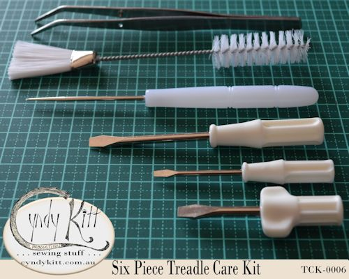
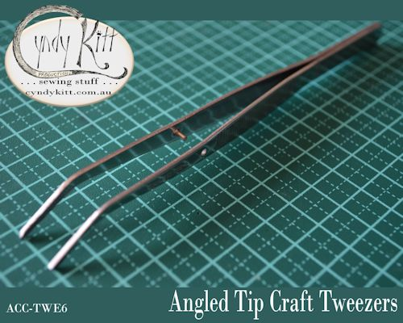
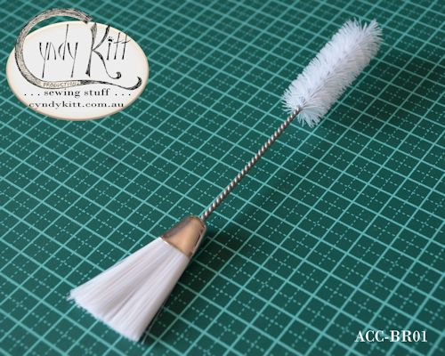
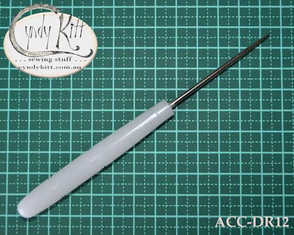
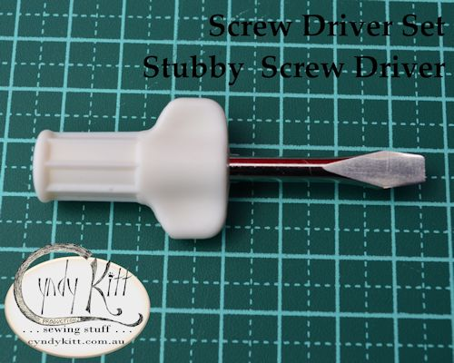
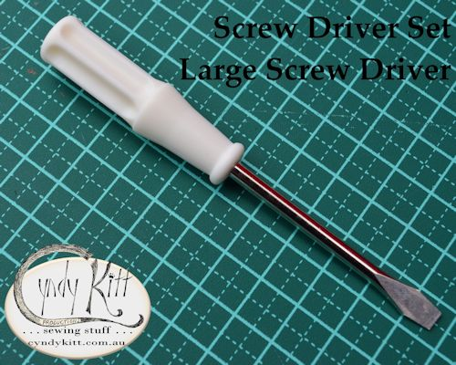
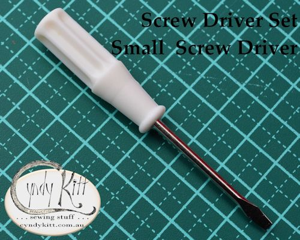

<table width="800" border="0" cellspacing="4" cellpadding="3" align="center">
  <tr> 
    <td colspan="2" height="62"> 
      <h3 align="center">Essential tools for every treadle sewing machinist's 
        care-kit</h3>
      
<b>Double ended nylon bristle lint brush:</b> 
        <i>approximately 17.5cm long</i> 
        <b>Tweezers: </b><i>approximately 16.5cm long with an angled tip</i> 
        <b>Awl: </b><i>137mm total length, 67mm spike length, 10&times;70mm plastic 
        handle</i> 
        <b>Screw Driver Set </b> 
        <b>Stubby wing driver: </b><i>70mm long, 5mm blade</i> 
        <b>Small driver: </b><i>78mm long, 2.5mm blade</i> 
        <b>Large driver: </b><i>110mm long, 5mm blade</i>

      </td>
  </tr>
  <tr> 
    <td width="174"></td>
    <td width="602">The double ended lint brush and the angle tip tweezers are 
      the same as those I started using when I worked in factories 30 years ago 
      and I have never come across better tools for getting into and cleaning 
      out all those hard to reach nooks and crannies, and while I may have gone 
      through a few brushes over the years, I still have the pair of tweezers 
      I bought about 20 years ago and the one in this kit is of equal quality. 
      While you will find the awl has other uses (such as marking dart points 
      etc.), it is also the cheapest and easiest way to punch a new hole though 
      your leather drive belt after it has been adjusted to the correct size (a 
      standard pair of household pliers are all you need to cut the belt and close 
      the staple). 
      As for the screwdrivers, these are my idea of the perfect set for sewing 
      machines whether a vintage, modern or industrial; the small one is for adjusting 
      the bobbin case or shuttle tension, the large one for general use and the 
      stubby one is the real gem because there are many screws in tight spaces 
      on sewing machines such as on the throat plate. </td>
  </tr>
  <tr>
    <td colspan="2"> 
      

      

      

      

      

      

      

      </td>
  </tr>
  <tr> 
    <td colspan="2"> 
      
 
        <h3><a href="../pricelist/p09.htm">Back to Catalogue Listing</a></h3>
        
&nbsp;

        

    </td>
  </tr>
</table>
